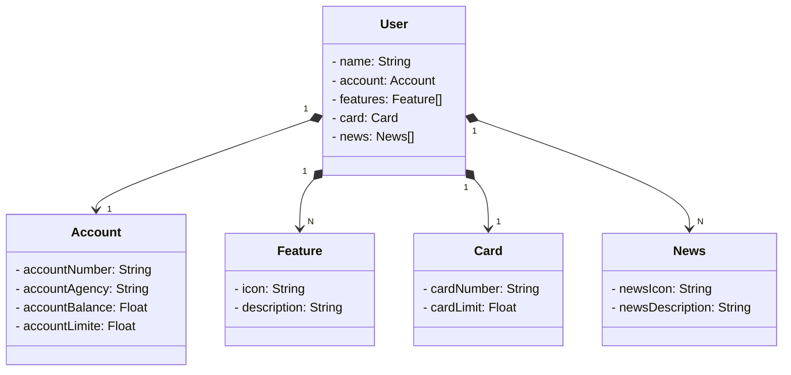

# DesafioAPI-REST

## Diagrama de Classes

```mermaid
classDiagram
  class User {
    - name: String
    - account: Account
    - features: Feature[]
    - card: Card
    - news: News[]
  }

  class Account {
    - accountNumber: String
    - accountAgency: String
    - accountBalance: Float
    - accountLimite: Float
  }

  class Feature {
    - icon: String
    - description: String
  }

  class Card {
    - cardNumber: String
    - cardLimit: Float
  }

  class News {
    - newsIcon: String
    - newsDescription: String
  }

  User "1" *--> "1" Account
  User "1" *--> "N"Feature
  User "1" *--> "1" Card
  User "1" *--> "N" News
```
